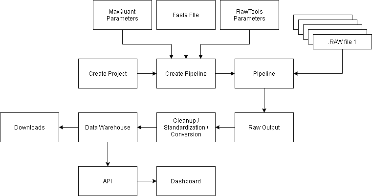
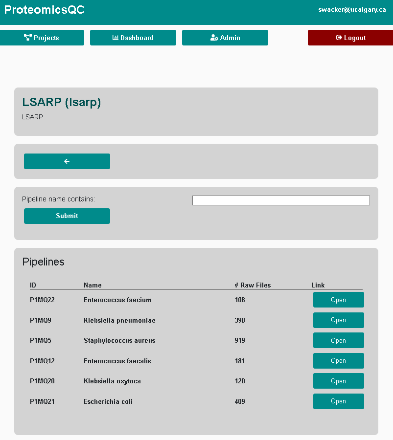

# **ProteomicsQC**: Quality Control Server for large-cohort quantitative proteomics using tandem-mass-tags (e.g. TMT11)

A quality control (QC) pipeline server for quantitative proteomics, automated processing, and interactive visualisations of QC results.
The server allows to setup multiple proteomics pipelines grouped by projects. 
The user can drag and drop new RAW mass spectrometry files which are processed automatically. 
Results are visualized in an interactive dashboard and accessible via a RESTful API for third party applications and extensions.
The server can be started with a single command using `docker-compose`.
Underlying software is _MaxQuant_ and _RawTools_ for proteomics, _Django_ for the web-server and API and _Plotly/Dash_ for the interactive dashboard.

More information can be found in the [Documentation](https://LewisResearchGroup.github.io/ProteomicsQC/).

## Installation

This repository contains git submodules and should be cloned with:

    git clone --recursive git@github.com:LewisResearchGroup/ProteomicsQC.git

After cloning the repository a configuration file needs to be created and edited.

    ./scripts/generate_config.sh  # generates a .env file for configuration

This will create the `.env` file in the root directory of ProteomicsQC.

    #.env content
    # OMICS PIPELINES CONFIG
    
    ## HOMPAGE SETTINGS
    HOME_TITLE=ProteomicsQC
    HOSTNAME=localhost
    ALLOWED_HOSTS=localhost
    
    ## STORAGE
    DATALAKE=./data/datalake
    COMPUTE=./data/compute
    MEDIA=./data/media
    STATIC=./data/static
    DB=./data/db
    
    ## EMAIL SETTINGS
    EMAIL_HOST=smtp.gmail.com
    EMAIL_USE_TLS=True
    EMAIL_USE_SSL=False
    EMAIL_PORT=587
    EMAIL_HOST_USER=''
    EMAIL_HOST_PASSWORD=''
    DEFAULT_FROM_EMAIL=''
    
    ## CELERY
    CONCURRENCY=8
    RESOURCE_RETRY_SECONDS=60
    MIN_FREE_MEM_GB_MAXQUANT=8
    MAX_LOAD_PER_CPU_MAXQUANT=0.85
    MIN_FREE_MEM_GB_RAWTOOLS=2
    MAX_LOAD_PER_CPU_RAWTOOLS=0.95
    
    ##USERID
    UID=1000:1000
    
    ## SECURITY KEYS
    SECRET_KEY=

The storage section defines the relative or absolute paths to the file system of your server to store persistent data.
Importantly, for production the location of the static folder should be exposed by your server under `https://your-url/static`, since
Django does not serve static files in production. We recommend using NGINX to serve the static files. 

To enable email-notifications (e.g. for authentification, or password changes) from the server the EMAIL settings need to be updated with information from your email provider.
If you use your own domain to serve ProteomicsQC, you need to add it to the `ALLOWED_HOSTS` as a comma separated list:
    
    HOSTNAME=localhost
    ALLOWED_HOSTS=localhost,your-url,your-internal-ip
    OMICS_URL=http://localhost:8080

You can start the server with the following commands:

    make init  # to start the server the first time

    make devel  # starts a development server on port 8000
    
    make serve  # starts the production server on port 8080

Resource-aware scheduling for Celery tasks is enabled by default. Each task checks
current host load and free memory before starting; if resources are tight, it is retried
after `RESOURCE_RETRY_SECONDS`. Thresholds can be tuned in `.env` using the
`MIN_FREE_MEM_GB_*` and `MAX_LOAD_PER_CPU_*` variables above.

## Limitations
The pipeline is restricted to single file setup which might conflict with the setup of some laboratories that split sample results into multiple files. The pipeline processes each file separately and independently.

## Overview

The server manages proteomics pipelines belonging to multiple projects. The server is mostly implemented in Python and is composed of several components such as a PostgreSQL database, a queuing system (Celery, Redis), a dashboard (Plotly-Dash) and an API (Django REST-Framwork).

## Features

1.  Different project spaces    
2.  Setup of different pipelines (using MaxQuant and RawTools)
3.  Upload .RAW files and automatic submission to a job queueing system
4.  Data management of input and output files
5.  User rights management
6.  Data API for programmatic file submission and download of results
7.  Dashboard for quality control (QC)
8.  Anomaly detection with Isolation Forest and explainable AI using SHAP

## The GUI

### Pipelines overview
The server has a simple static http frontend and admin view, generated with Django; and a dynamic and interactive dashboard implemented with Plotly-Dash. The Project detail-view, for example, shows and overview over all pipelines associated with the current project and the number of submitted files.

### Admin view

Django is a popular web framework for building web applications in Python. The Django admin view is a built-in feature of Django that provides an easy-to-use interface for managing the application's data models. The admin view is automatically generated based on the models defined in the application's code, and allows administrators to perform CRUD (Create, Read, Update, and Delete) operations on the application's data. This way new projects, and pipelines can be setup. It also provides an overview over all results and raw files stored on the server and can be used for troubleshooting, if some runs are unsuccessful.

## Dashboard

When the user drops a file to the web-upload page of a particular pipeline, it is automatically processed and the results are sent to the dashboard.
Here, all quality control metrics can be visualized simultaneously in customized order, and the relationships between QC metrics can be plotted.
Timelines of up to 60 quality control metrics can be viewed simultanously in one place. 

-   `accepted` samples for downstream processing have a dark hue
-   `rejected` samples have a brighter hue 
-   `normal` samples are colored blue
-   `flagged` samples, potential outliers, are colored red 

