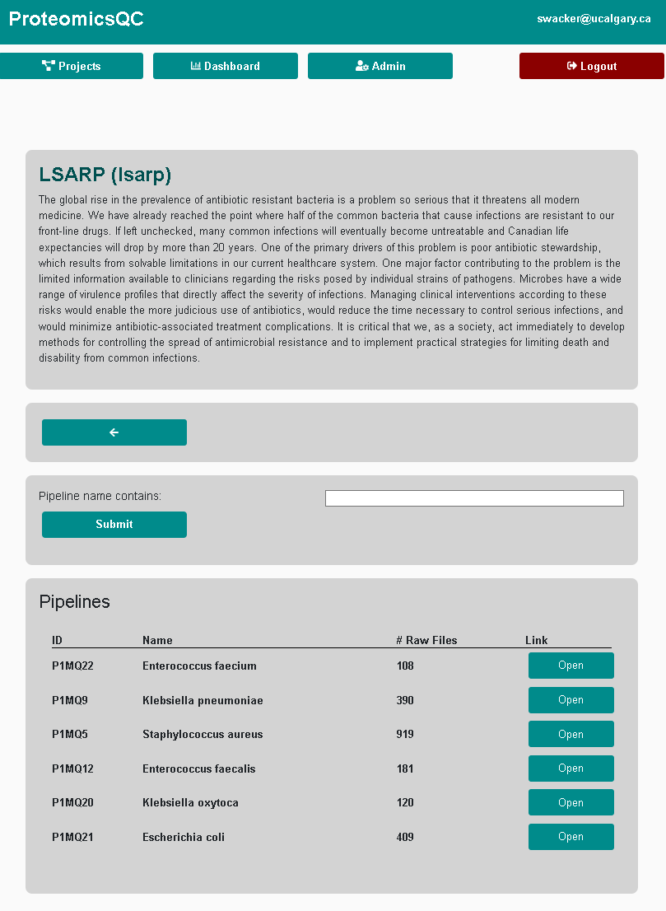

# **ProteomicsQC**: Quality Control Server for large-cohort quantitative proteomics based tandem-mass-tags (e.g. TMT11)

A quality control (QC) pipeline server for quantitative proteomics, automated processing, and interactive visualisations of QC results.
The server allows to setup multiple proteomics pipelines grouped by projects. 
The user can drag and drop new RAW mass spectrometry files which are processed automatically. 
Results are visualized in an interactive dashboard and accessible via a RESTful API for third party applications and extensions.
The server can be started with a single command using `docker-compose`.
Underlying software is _MaxQuant_ and _RawTools_ for proteomics, _Django_ for the web-server and API and _Plotly/Dash_ for the interactive dashboard.

More information can be found in the [Documentation](https://LewisResearchGroup.github.io/ProteomicsQC/).

## Installation

This repository contains git submodules and should be cloned with:

    git clone --recursive git@github.com:LewisResearchGroup/ProteomicsQC.git

    ./scripts/generate_config.sh  # generates a .env file for configuration

    make init  # to start the server the first time

    make devel  # starts a development server on port 8000
    
    make serve  # starts the production server on port 8000

## Limitations
The pipeline is restricted to single file setup which might conflict with the setup of some laboratories that store single sample results in multiple files. The pipeline processes each file separately and independently.

## Overview

The server manages proteomics pipelines belonging to multiple projects. The server is mostly implemented in Python and is composed of several components such as a PostgreSQL database, a queuing system (Celery, Redis), a dashboard (Plotly-Dash) and an API (Django REST-Framwork).

## Features

1. Different project spaces    
2. Setup of different pipelines (using MaxQuant and RawTools)
3. Upload and processing .RAW files with a job queueing system
4. Data management of input and output files
5. User rights management
6. Data API for programmatic file submission and download of results
7. Dashboard for Quality Control
8. Anomaly detection with Isolation Forest and explainable AI using SHAP

## The GUI

### Pipelines overview
The server has a simple static http frontend and admin view, generated with Django; and a dynamic and interactive dashboard implemented with Plotly-Dash.

### Admin view

Django is a popular web framework for building web applications in Python. The Django admin view is a built-in feature of Django that provides an easy-to-use interface for managing the application's data models. The admin view is automatically generated based on the models defined in the application's code, and allows administrators to perform CRUD (Create, Read, Update, and Delete) operations on the application's data. This way new projects, and pipelines can be setup. It also provides an overview over all results and raw files stored on the server and can be used for troubleshooting, if some runs are unsuccessful.

## Dashboard

All quality control metrics can be visualized simultaneously in customized order.
This way the user can visalize the timelines of ~60 quality control metrics in one place. 
Bright hue samples are excluded from downstream processing. Red samples are flagged as potential outliers.

### Explainable AI explation for anomaly

Anomaly detection with Isolation forest explained with SHapley Additive exPlanations (SHAP).

### Scatterplot tool to explore relationships between variables

Intactive tool to explore feature interactions and to create selections. 

### Visualization of normalized reporter intensity (TMT11)
.')
All reporter intensities in one plot to detect batch effects for individual proteins. 

