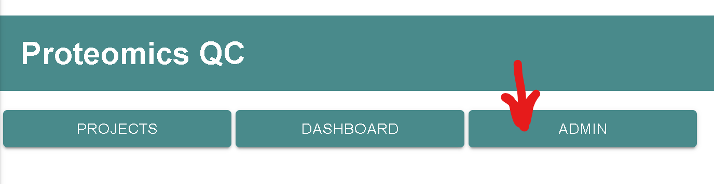
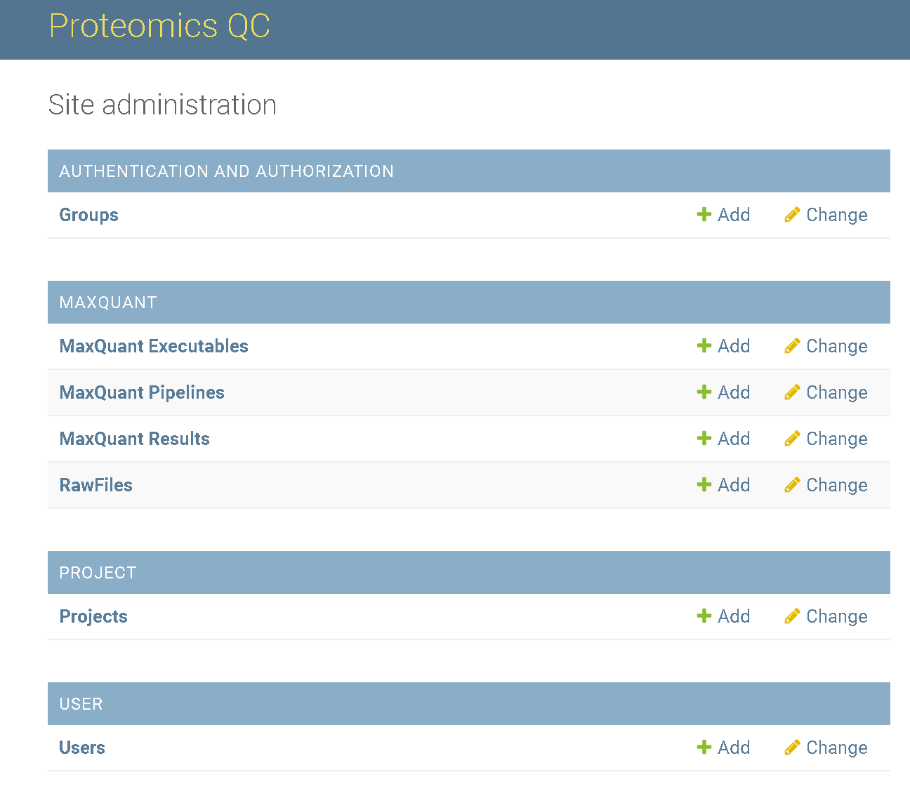

# How to access the admin panel?

If you followed the steps in the [installation](installation.md) you
have already created an admin account and started the ProteomicsQC server.

Use a web browser and navigate to [localhost:8000](localhost:8000) or
your own custom domain. 

> In this example we use [https://proteomics.resistancedb.org](https://proteomics.resistancedb.org)

Now, you can navigate to the admin page using the `ADMIN` button.

This will bring you to the login form [https://proteomics.resistancedb.org/admin/](https://proteomics.resistancedb.org/admin/).

After successfull login the following view opens.

This is the admin panel where users, projects, and pipelines can be managed.

