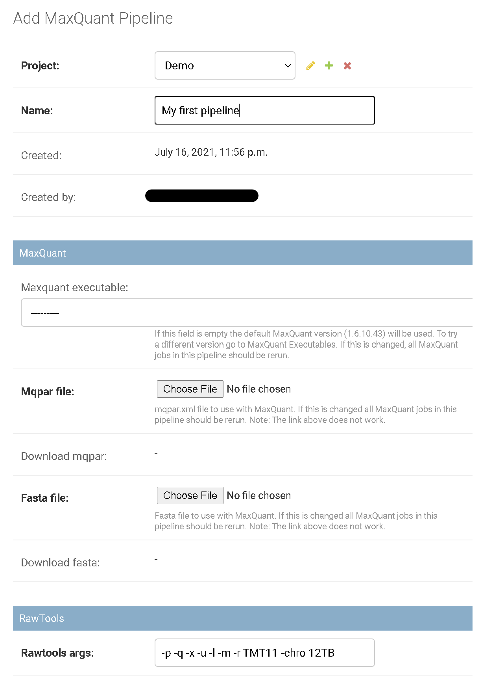

# How to add a pipeline?

To add a new pipeline the user has to login to the [admin panel](how-to-access-the-admin-panel.md) 
and at least one project has to exist. Otherwise, contact your admin or read [how to add a project](how-to-add-a-project.md).

Under site administration the click on [MaxQuant Pipelines](https://proteomics.resistancedb.org/admin/maxquant/maxquantpipeline/).

Click on the add sign behind _Maxquant pipelines_ to get to the pipeline creation form:

Here, fill up the editable fields (name and a description).

1. Select the MaxQuant version. If no version is selected the default version will be used (recommended).
2. Add a `Fasta` file with amino-acid sequences of target proteins. 
3. Add a `mqpar.xml` (MaxQuant parameter file) generated with _MaxQuant_. The file should be generated with a single `.raw` file and the _MaxQuant_ version should match the [version used in the pipeline](maxquant.md).
4. Provide command line parameters for [RawTools](https://github.com/kevinkovalchik/RawTools). Read [Rawtools Help](rawtools.md) for more information.

> Not all _MaxQuant_ versions are compatible with _Proteomics QC_. We recommend using the [default version](maxquant.md) if possible.

Finally, click on `SAVE`.

