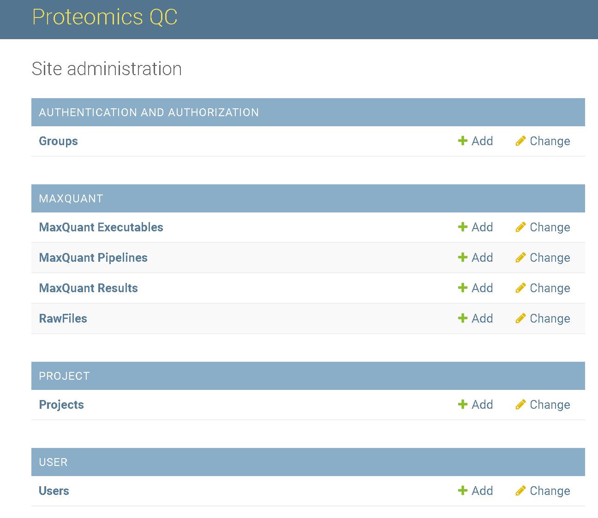

# How to add a new project?

A project is a logical container for pipelines. Each project can contain multiple pipelines and all files 
submitted to certain or added within a certain project will be stored in a dedicated project directory in
the datalake. 

To set up a new pipeline the user has to login to the [admin panel](how-to-access-the-admin-panel.md).

Click on the add sign behind _Project_ to get to the project creation form:

Here, fill up the editable fields (name and a description). 
In this example we call the new project `Demo`. 
Then click on `SAVE` to create the new project.

You will be redirected to the _Projects Overview_ and the new project appears on the top of the list:

Congratulations you added a new project.

