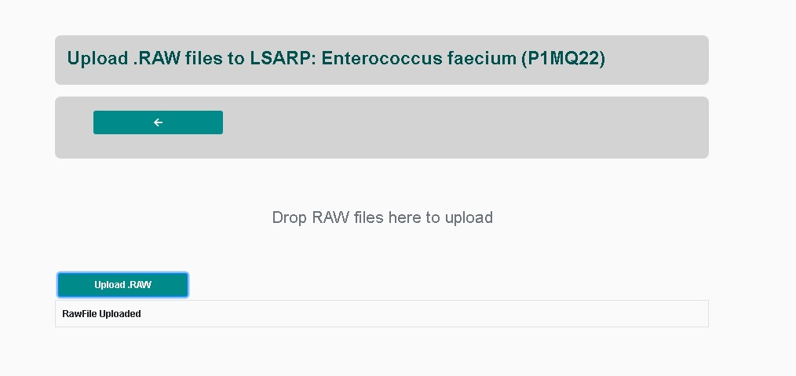

# How to submit RAW files to an existing pipeline?

There are three ways to add new raw files to an existing pipeline. 

## 1) Web frontend
The most straightforward way to submit RAW files to an existing pipeline 
is the web frontend. After setting up a pipeline you can navigate to the 

Projects -> Your project -> Your pipeline -> Upload RAW

## 2) Admin panel

## 3) Using the API

