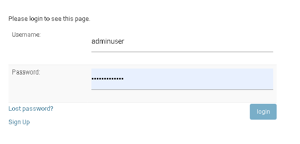
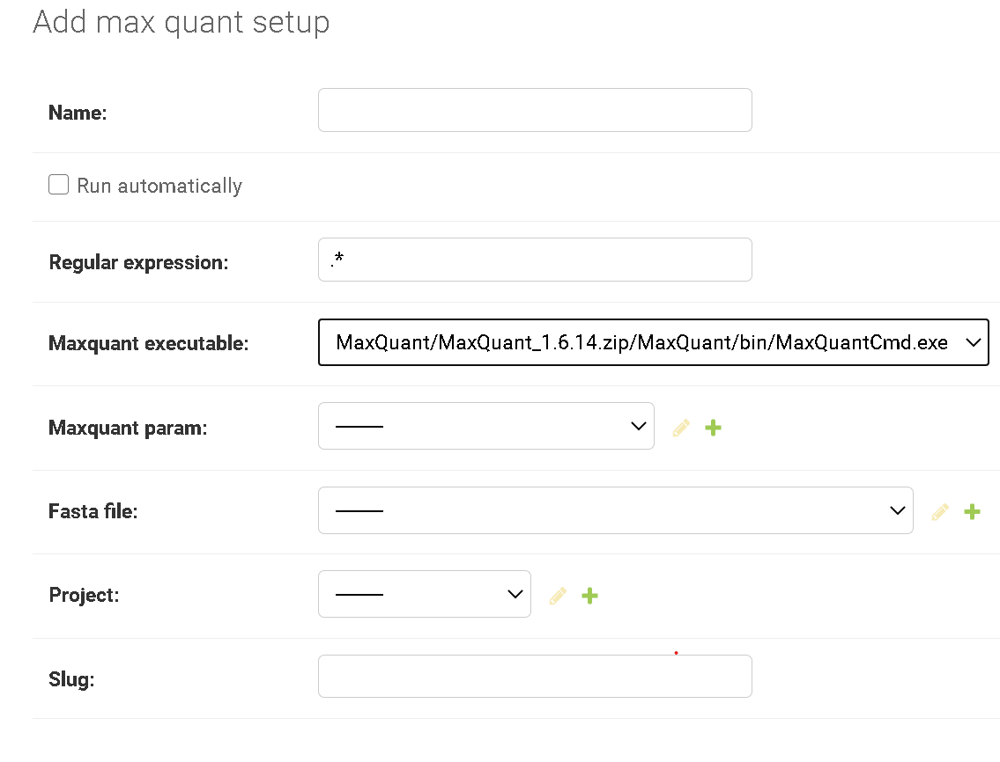

# User manual

Please, have a look at the [installation instructions](installation.md) and how to start the pipeline server.

## Login with an admin account

When you visit the website for the first time you will be redirected to the login page.
A new user can register a new account with a valid email address. To visit the 
admin page the user has to be granted the rights by an admin. If you do not have setup
an admin account

To setup a 

## Setup MaxQuant

To setup MaxQuant you can upload a zipped MaxQuant version. 
Version 1.6.14 works with [Mono](https://www.mono-project.com/docs/about-mono/) and is the recommended version to use with the Proteomics Pipelines server.
Please contact the MaxQuant [mailing list](https://groups.google.com/u/1/g/maxquant-list/c/X94RkHSoEYo/m/LuYDKHskDwAJ) for information on how to obtain older versions. 

Once you downloaded the zip-file you can upload it to the Pipeline server. Go to 'admin/pipelines/maxquantbin/add' and upload the zip file from 
[Admin / Max quant bins / ADD MAX QUANT BIN](http://localhost:8000/admin/pipelines/maxquantbin/add/). If successful the executable will be selectable under [Admin / Max quant setups / ADD MAX QUANT SETUP/](http://localhost:8000/admin/pipelines/maxquantsetup/add/).

If this is done you can create your first pipeline. 

## Create first pipeline

### 1. Create a new project
At least one project has to be set up. Navigate to [Admin / Projects / ADD PROJECT](http://localhost:8000/admin/pipelines/project/) and provide 
a name and a description. 

### 2. Upload Fasta File

A fasta file with protein sequences has to be uploaded. 

### 3. Upload mqpar.xml

A `mqpar.xml` file has to be provided for each pipeline. It has to be created using the MaxQuant GUI. Only a single `.RAW` file should be included.

### 4. Create MaxQuant Setup

The MaxQuant Setup defines a pipeline. It is a combination of a MaxQuant binary, a MaxQuant parameter file (mqpar.xml) and a Fasta file. 
Once created you will be able to submit `.RAW` files to this pipeline. 

### 5. Setup RawFile type for RawTools

